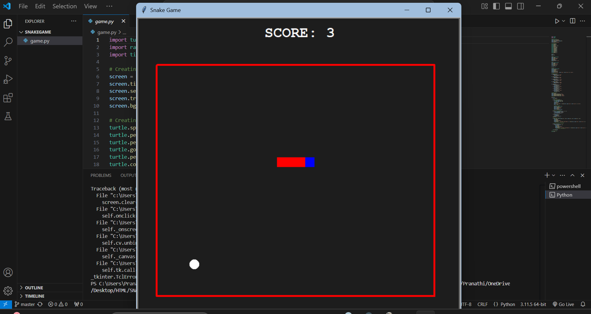
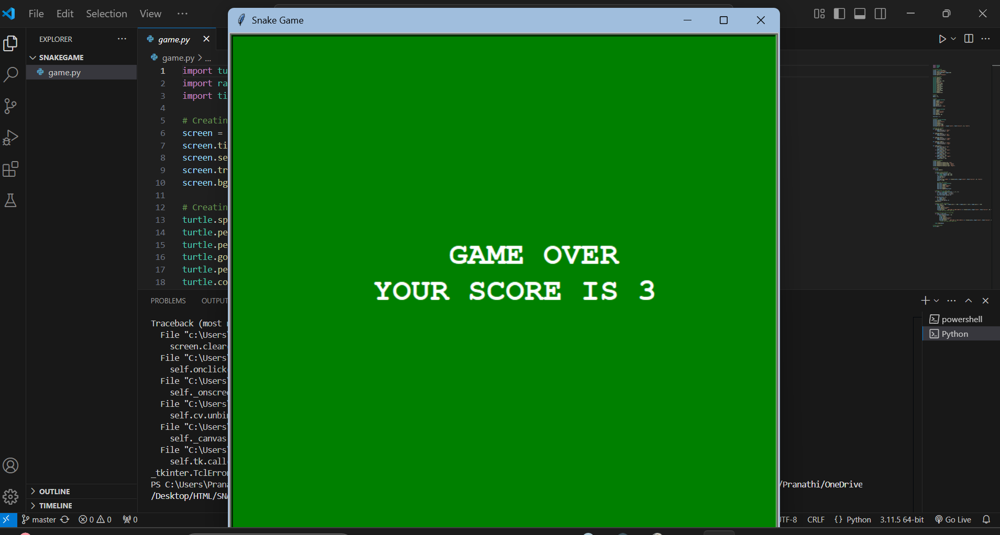

# 🐍 Classic Snake Game (Python Turtle)

A terminal-based snake game built using Python's `turtle` graphics library. This project demonstrates fundamental programming concepts like loops, collision detection, event handling, and score management — perfect for beginners and a fun project to learn Python.

---

## 🎮 Gameplay Overview

- Control the snake using arrow keys.
- Eat the food to grow the snake and earn points.
- Avoid colliding with the walls or your own tail — or it's **Game Over**!
- Score increases with every fruit eaten, and the game gets slightly faster.

---

## 🛠️ Technologies Used

- **Language**: Python 3
- **Graphics**: Turtle Module (built-in)
- **Concepts Covered**:
  - Game loops
  - Collision detection
  - Event-driven input handling
  - Dynamic score updates
  - Basic OOP (Turtle objects)

---

## 🚀 Features

- 🧱 Bounded Play Area
- 🐍 Snake movement with real-time response
- 🍎 Random food generation on the board
- 🧠 Snake body growth logic
- 📈 Score tracking and display
- 💀 Game-over detection (on self or wall collision)
- 🖼️ Custom colors and shapes for game elements

---
## 📸 Screenshots

### 🎮 Gameplay


### 💀 Game Over


---
## 🖥️ How to Run

### Prerequisites:
- Python 3 installed on your system

### Steps:

```bash
git clone https://github.com/your-username/snake-game-python.git
cd snake-game-python
python snake_game.py

